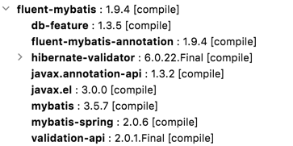
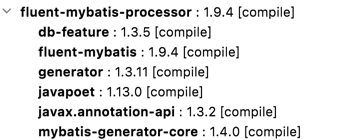

# maven依赖配置

```
<properties>
    <fluent-mybatis.version>1.9.4</fluent-mybatis.version>
</properties>
<dependencies>
    <!-- 引入fluent-mybatis 运行依赖包, scope为compile -->
    <dependency>
        <groupId>com.github.atool</groupId>
        <artifactId>fluent-mybatis</artifactId>
        <version>${fluent-mybatis.version}</version>
    </dependency>
    <!-- 引入fluent-mybatis-processor, scope设置为provider 编译需要，运行时不需要 -->
    <dependency>
        <groupId>com.github.atool</groupId>
        <artifactId>fluent-mybatis-processor</artifactId>
        <scope>provided</scope>
        <version>${fluent-mybatis.version}</version>
    </dependency>
    <!-- 其它应用需要的 mysql driver、druid等数据库需要的jar自行引入 -->
</dependencies>
```

其中fluent-mybatis是fluent-mybatis运行时的正主，需要设置为compile级别
而fluent-mybatis-processor是编译时，根据Entity文件生成一系列辅助类的处理器，依赖级别为provided就可以。

## fluent-mybatis依赖项



### 必须项(FluentMybatis核心功能需要)
- com.github.atool:fluent-mybatis-annotation:1.9.4
- com.github.atool:db-feature:1.3.5
- org.mybatis:mybatis:3.5.7
- org.mybatis:mybatis-spring:2.0.6

### 可选项(FormService功能参数校验需要)
- org.hibernate.validator:hibernate-validator:6.0.22.Final
- javax.validation:validation-api:1.3.2
- javax.annotation:javax.annotation-api:1.3.2
- org.glassfish:javax.el:3.0.0

## fluent-mybatis-processor依赖项



- com.github.atool:fluent-mybatis
- com.github.atool:db-feature:1.3.5
- com.github.atool:generator:1.3.14
- com.squareup:javapoet:1.13.0
- org.mybatis.generator:mybatis-generator-core:1.4.0
- javax.annotation:javax.annotation-api:1.3.2

# 工具默认应用会配置好的环境
- spring和spring boot系列 （如果非spring系统，参考mybatis非spring环境的运行机制）
- 数据源配置
- lombok (代码生成的Entity需要lombok）

# [示例](https://gitee.com/fluent-mybatis/fluent-mybatis-docs/blob/master/01-hello-world/pom.xml)
