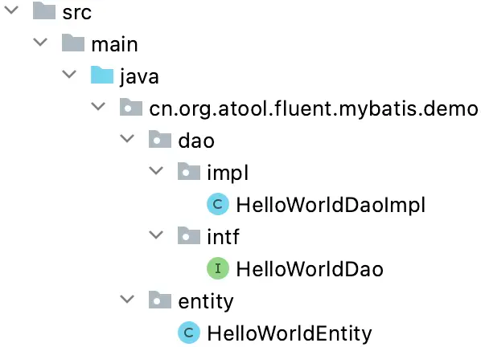
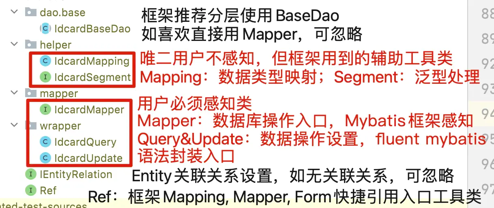
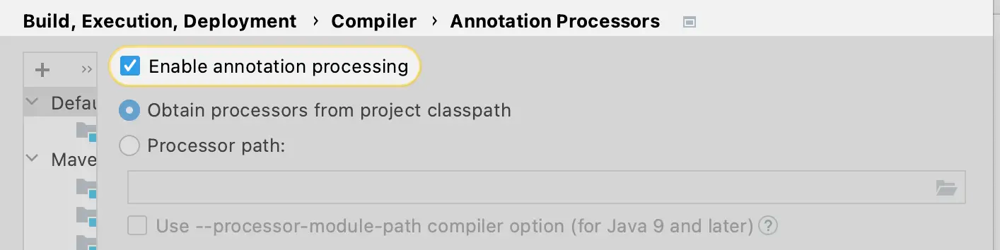
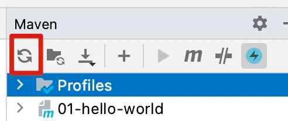
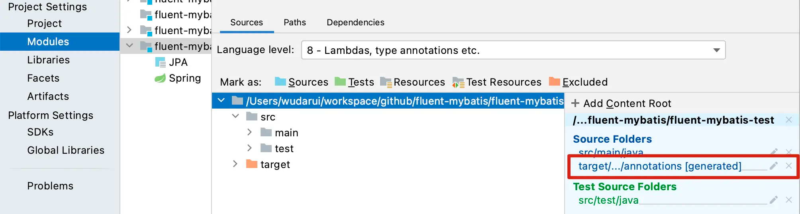

以下教程以IDEA环境讲解， eclipse环境同学，可以参考 [在eclipse中使用springboot整合fluent-mybatis](https://blog.csdn.net/weixin_43585799/article/details/121506805)

# 示例脚本

```
create database if not exists fluent_mybatis;
drop table if exists hello_world;
create table hello_world
(
    id           bigint unsigned auto_increment primary key,
    say_hello    varchar(100) null,
    your_name    varchar(100) null,
    gmt_created   datetime   DEFAULT NULL COMMENT '创建时间',
    gmt_modified datetime   DEFAULT NULL COMMENT '更新时间',
    is_deleted   tinyint(2) DEFAULT 0 COMMENT '是否逻辑删除'
) ENGINE = InnoDB
  CHARACTER SET = utf8 comment '简单演示表';
```

# FluentMybatis的Entity代码生成

```
import cn.org.atool.generator.FileGenerator;
import cn.org.atool.generator.annotation.*;

public class EntityGeneratorDemo {
    // 数据源 url
    static final String url = "jdbc:mysql://localhost:3306/fluent_mybatis?useUnicode=true&characterEncoding=utf8";
    // 数据库用户名
    static final String username = "root";
    // 数据库密码
    static final String password = "password";


    @Test
    public void generate() throws Exception {
        // 引用配置类，build方法允许有多个配置类
        FileGenerator.build(Empty.class);
    }

    @Tables(
        // 设置数据库连接信息
        url = url, username = username, password = password,
        // 设置entity类生成src目录, 相对于 user.dir
        srcDir = "src/main/java",
        // 设置entity类的package值
        basePack = "cn.org.atool.fluent.mybatis.demo",
        // 设置dao接口和实现的src目录, 相对于 user.dir
        daoDir = "src/main/java",
        // 设置哪些表要生成Entity文件
        tables = {@Table(value = {"hello_world"})}
    )
    static class Empty { //类名随便取, 只是配置定义的一个载体
    }
}
```

# 执行测试, 生成的Entity类

其中, XyzDao 和 XyzDaoImpl是空类,再次运行代码不会覆盖生成
Entity是Fluent Mybatis运行的正主, 不要手工改动, 重新运行代码生成会进行覆盖, 保持数据库变更的一致。


```
@Data
@Accessors(
    chain = true
)
@EqualsAndHashCode(
    callSuper = false
)
@FluentMybatis(
    table = "hello_world"
)
public class HelloWorldEntity extends RichEntity {
  private static final long serialVersionUID = 1L;

  /**
   */
  @TableId("id")
  private Long id;

  /**
   * 创建时间
   */
  @TableField("gmt_created")
  private Date gmtCreated;

  /**
   * 更新时间
   */
  @TableField("gmt_modified")
  private Date gmtModified;

  /**
   * 是否逻辑删除
   */
  @TableField("is_deleted")
  private Integer isDeleted;

  /**
   */
  @TableField("say_hello")
  private String sayHello;

  /**
   */
  @TableField("your_name")
  private String yourName;

  @Override
  public Serializable findPk() {
    return this.id;
  }

  @Override
  public final Class<? extends IEntity> entityClass() {
    return HelloWorldEntity.class;
  }
}
```

# 生成代码后编译
在Entity代码生成后，执行IDE编译，或者maven(gradle)编译，会在target目录下生成下面代码列表


大家重点关注 XyzMapper, XyzQuery, XyzUpdate 这3个类即可
Mapper类是Mybatis的接口类，需要加入到mybatis的扫描路径中

```
@MapperScan({"cn.org.atool.fluent.mybatis.demo.mapper"})
```

XyzQuery和XyzUpdate是应用中用来拼装查询语句和更新语句的工具类。

Idea的AnnotationProcessor开关


正常情况下， IDE会自动把target/generated-sources/annotations 添加到源码路径下，如果碰到找不到类的情形

点击maven视图的刷新按钮，会自动添加工程源码路径


gradle的同学同理，刷新gradle视图

如果再不行，手工大法


## maven和gradle
maven和gradle打包会自动把target/generated-sources/annotations下文件编译到classes下。
源码也会自动打包到 sources.jar里面